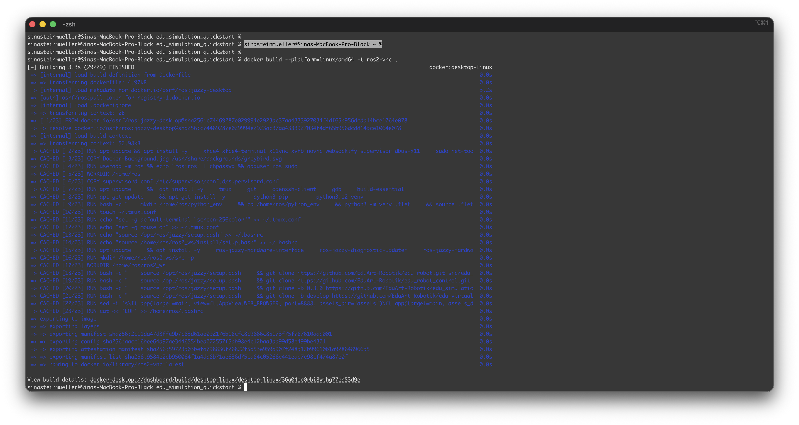

# Schnellstart mit Docker

Diese Anleitung ist dafür gedacht, schnell in die Eduard Simulation zu starten. Wenn du keine Lust auf die manuelle Einrichtung hast und direkt erste Erfahrungen mit der Simulation starten willst, ist diese Anleitung für dich geeignet. Wenn du lernen willst, wie man seine Linuxumgebung selbst einrichtet, überspringe dieses Kapitel und beginne mit "[Plattformunabhängige Installation mit Docker](3_docker-installation.md)". 

Die folgenden Quickstart-Anleitungen sind Betriebssystemunabhängig, um die Einrichtung von Ubuntu auf dem eigenen Betriebssystem oder als Virtuelle Maschine zu vermeiden. Für Linuxnutzer empfielht es sich, die "normale" Installation zu verwenden (Weiter bei [ROS Workspace anlegen](5_ros-workspace.md)).
## Voraussetzungen

- Vorhandener Github Account mit hinterlegtem SSH Key für `git clone` 
- [SSH Key anlegen](1_github-ssh-key.md) mit der EduArt Anleitung
- [Offizielle Github Anleitung](https://docs.github.com/en/authentication/connecting-to-github-with-ssh/generating-a-new-ssh-key-and-adding-it-to-the-ssh-agent)

## Benötigte Software

- [Docker Hub ](https://docs.docker.com/desktop/setup/install/mac-install/), installiert, AGBs akzeptiert und mal geöffnet

optional
- [VNC Viewer](https://www.realvnc.com/de/connect/download/viewer/) installiert
- [Visual Studio Code](https://code.visualstudio.com/download) installiert 
## Installation

- Erstelle einen Ordner "EduArt" in deinen Dokumenten
- Öffne den Ordner EduArt im Dateimanager 

Auf Mac:
- Rechtsklick auf den Ordnernamen in der Pfadleiste unten und "in Terminal öffnen"

Auf Windows: 
- Rechtsklick "in PowerShell öffnen" oder "in Terminal öffnen"

im Terminal:
- mit `cd` in den Ordner rein navigieren, z.B. 
```
cd Documents/EduArt
```
- enter drücken

Terminal öffnen und folgenden Befehl eingeben:
```
git clone git@github.com:EduArt-Robotik/edu_simulation_quickstart.git
```
- wenn hier was von "authentication failed" steht, ist der Github SSH Key nicht richtig angelegt

Wenn das Repo dann fertig geklont ist
```
cd edu_simulation_quickstart
```

Dockercontainer bauen (dauert je nach Computer und Arbeitsspeicher zwischen 3 und 20 min). 
```
docker build --platform=linux/amd64 -t ros2-vnc .
```
- Bei Änderungen im Dockerfile oder in der Supervisord.config muss immer neu gebaut werden. Änderungen können Beispielsweise das Hintergrundbild im Container oder die Bildschirmauflösung sein.


Wenn der Container erfolgreich gebaut ist, den Dockercontainer starten:
```
docker compose -f docker-compose.yml up
```


Danach im Browser öffnen: http://localhost:8080/vnc.html und auf "Verbinden klicken"


Optional in VNC Viewer integrieren
- VNC Viewer (oder alternative Software) öffnen
- Datei / Neue Verbindung / localhost:5900 

## Tipps
- Copy + Paste über die noVNC Seitenleiste links

## Simulation starten
Terminal in Simulation öffnen, dann öffnet sich automatisch ein 4-geteiltes Terminalfenster mit 4 Kommandos.


In Fenster 1, links oben, startet das Programm "Gazebo", das ein Labyrinth zeigt. Hier ist Links unten ein Button "Run the simulation", diesen drücken.


In Fenster 2, links unten, startet der Virtuelle Controller für den Roboter.


Fenster 3, rechts oben, platziert einen blauen Eduardroboter im Labyrinth in Fenster 1. Wenn du die Simulation in Fenster 1 gestartet hast, klicke in dieses Terminalfenster (rechts unten in der grünen Leiste steht dann der Name des Fensters "3. Add Eduard"). Drücke Enter, dann ist der blaue Roboter im Labyrinth.
Skaliere das Fenster ggf., sodass du die Buttons unten siehst und drücke "Remote". Erfolgreich, wenn der Button grün wird. Dann kannst du mit dem linken Joystick fahren und mit dem rechten Joystick dich drehen.


Optional: Fenster 4 öffnet das Monitoring in RVIZ.


## Troubleshooting

Fehler: ` ✘ ros2-vnc Error pull access denied for ros2-vnc, repository does not exist or may require 'docker login'` oder:  `if container already exists`: 

```
docker compose -f docker-compose.run.yml down
```

und danach dann 
```
docker compose -f docker-compose.run.yml up
```


Fehler `ERROR: Cannot connect to the Docker daemon at unix:///Users/sinasteinmueller/.docker/run/docker.sock. Is the docker daemon running?`
- Docker Desktop App starten

Bildschirmauflösung passt nicht (Containerinhalt zu klein, zu groß oder abgeschnitten): in der `supervisord.config` Datei die Zeile `command=/usr/bin/Xvfb :0 -screen 0 1920x900x24` mit der gewünschten Bildschirmanpassung ändern, z.B. in 1280x1024x24

## Tipps
Bildschirmgröße des Containers ändern 
- In Datei `supervisord.conf` im geklonten Repo in folgender Zeile

```
command=/usr/bin/Xvfb :0 -screen 0 1920x900x24
```

Hintergrundbild ändern
- Vor dem Bauen des Containers das Aktuelle Hintergrundbild `Docker-Background.svg` durch die neue, gewünschte SVG (!) Datei ersetzen
- Repo neu bauen und starten

