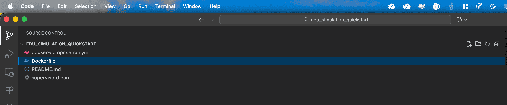
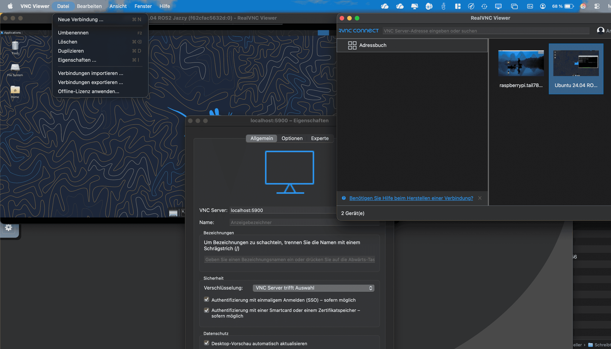

# Plattformunabhängige Installation mit Docker

Diese Anleitung richtet sich an alle, die kein vorgefertigtes Repo klonen wollen, sondern sich einen leeren, lauffähigen Linux Dockercontainer selbst erstellen und entweder im Browser oder im VNC Viewer anzeigen lassen wollen. Das ganze wird für Mac und Windows empfohlen, Linux- oder Ubuntunutzer können direkt weiter ins Kapitel >>TODO ROS Workspace springen. 

## Voraussetzungen

- Vorhandener Github Account mit hinterlegtem SSH Key für `git clone` [Anleitung](https://docs.github.com/en/authentication/connecting-to-github-with-ssh/generating-a-new-ssh-key-and-adding-it-to-the-ssh-agent)

## Benötigte Software

- Docker Hub [Downloadlink](https://docs.docker.com/desktop/setup/install/mac-install/), installiert, AGBs akzeptiert und mal geöffnet
- Visual Studio Code installiert [Downloadlink](https://code.visualstudio.com/download)

optional
- VNC Viewer installiert [Downloadlink](https://www.realvnc.com/de/connect/download/viewer/)

## Installation
- Erstelle einen Ordner "edu_simulation_quickstart" in deinen Dokumenten
- Öffne den Ordner edu_simulation_quickstart in VSC als Workspace (an sich ists egal wie der Ordner heißt, aber wir bauen eine vereinfachte Version des Quickstarts aus dem vorherigen Kapitel, deswegen verwenden wir den Namen im Folgenden.)
- Lege folgende Dateien an (Readme.md ist optional)



Kopiere folgenden Inhalt in die Dateien:

### Dockerfile

```dockerfile
FROM osrf/ros:jazzy-desktop

ENV DEBIAN_FRONTEND=noninteractive

# -------------------------------------------------------------------
# Create custom user and configure the user settings
# -------------------------------------------------------------------

# Create User
RUN useradd -m user -s /bin/bash && echo "user:user" | chpasswd && adduser user sudo
USER root


# -------------------------------------------------------------------
# Install dependencies
# -------------------------------------------------------------------


RUN apt update &&  apt install -y \
    tmux git openssh-client gdb build-essential software-properties-common swig

RUN apt-get update && apt-get install -y \
    python3-pip python3.12-venv python3-pip

RUN apt update && apt install -y \
    xfce4 xfce4-terminal x11vnc xvfb novnc websockify supervisor dbus-x11 \
    sudo net-tools curl wget

# Install GPIO MRAA lib for edu_robot_control_template
# Build and install MRAA from source
RUN git clone https://github.com/eclipse/mraa.git /opt/mraa \
    && cd /opt/mraa && mkdir build && cd build \
    && cmake .. -DBUILDSWIGPYTHON=ON \
    && make -j$(nproc) && make install \
    && ldconfig \
    && rm -rf /opt/mraa


# Install edu_robot dependencies
RUN apt update \
    && apt install -y \
    ros-jazzy-rmw-cyclonedds-cpp \
    ros-jazzy-hardware-interface \
    ros-jazzy-diagnostic-updater \
    ros-jazzy-hardware-interface \
    ros-jazzy-laser-geometry \
    ros-jazzy-gz-sim-vendor \
    ros-jazzy-ros-gz-bridge \
    ros-jazzy-ros-gz-sim \
    ros-jazzy-ros-gz \
    ros-jazzy-xacro \
    ros-jazzy-rviz2

# Create virtual environment with python modules for edu_virtual_joy
RUN bash -c "\
    mkdir /home/user/python_env -p \
    && cd /home/user/python_env \
    && python3 -m venv .flet \
    && source .flet/bin/activate \
    && pip3 install flet setuptools pyyaml \
    && pip install 'flet[all]==0.25.1' --upgrade"
# -------------------------------------------------------------------
# Install packages for simulation
# -------------------------------------------------------------------

# Create Ros2 workspace
# … 

# Get edu_robot package
# …

# Set Python environment
ENV PYTHONPATH='/home/ros/python_env/.flet/lib/python3.12/site-packages'

# Enable color on command prompt
ENV TERM=xterm-256color
ENV color_prompt=yes


# VNC setup
RUN mkdir -p /home/user/supervisor/logs /home/user/supervisor/run && \
    chown -R user:user /home/user/supervisor
COPY --chown=user:user supervisord.conf /home/user/supervisor/supervisord.conf

# -------------------------------------------------------------------
# Configure the user space
# -------------------------------------------------------------------

USER user
WORKDIR /home/user
ENV HOME=/home/user
ENV USER=user


# -------------------------------------------------------------------
# Environment variables
# -------------------------------------------------------------------

# Set Python environment
ENV PYTHONPATH='/home/user/python_env/.flet/lib/python3.12/site-packages'

# Enable color on command prompt
ENV TERM=xterm-256color
ENV color_prompt=yes

# Start supervisord
CMD ["/usr/bin/supervisord"]
```

`FROM osrf/ros:jazzy-desktop` 
Ist der Dockercontainer, der als Basis verwendet wird. Diesen findet man auch in der App Docker im Dockerhub. Als Alternative hierzu können auch andere ROS und Linuxversionen verwendet werden.

Alle anderen Befehle legen z.B. den Benutzer "ros" an, laden Pakete runter, installieren Dinge oder erstellen Ordner, die irgendwann mal gebraucht werden. Das könnte man auch alles hier in der Datei weglassen und stattdessen im neuen Betriebssystem dann im Terminal nachinstallieren. Wir sparen uns aber den Aufwand und die Nerven, alle fehlenden Pakete einzeln zu installieren. 

## supervisord.conf

```config
[supervisord]
nodaemon=true

[program:Xvfb]
command=/usr/bin/Xvfb :0 -screen 0 1920x900x24
priority=1
autostart=true
autorestart=true

[program:x11vnc]
command=/usr/bin/x11vnc -display :0 -forever -nopw -shared
priority=2
autostart=true
autorestart=true

[program:xfce4]
command=/usr/bin/startxfce4
environment=DISPLAY=":0"
priority=3
autostart=true
autorestart=true

[program:novnc]
command=/usr/share/novnc/utils/novnc_proxy --vnc localhost:5900 --listen 8080
priority=4
autostart=true
autorestart=true
```
Diese Datei sorgt dafür, dass ein Computer ohne echten Bildschirm trotzdem eine grafische Oberfläche hat.  
**Xvfb** tut so, als gäbe es einen Bildschirm.  
**x11vnc** macht diesen Bildschirm über das Internet erreichbar.  
**xfce4** zeigt den Desktop, und **noVNC** erlaubt, ihn direkt im Webbrowser zu sehen.

## Testen des Containers

Damit wir nun in unserem Browser ein Linuxbetriebssystem anzeigen können, reicht das erstmal. Wir öffnen nun in VSC ein Terminal und geben folgendes ein, um den Container zu bauen.

```
docker build --platform=linux/amd64 -t ros2-vnc .
```

So sollte das dann aussehen (kann ein paar min dauern):

Nun starten wir den Container:

```
docker run --platform=linux/amd64 -p 8080:8080 --shm-size=2g --name ros2-vnc-test ros2-vnc
```

Das sieht dann in etwa so aus:


Dann öffnen wir den Browser und geben ein: http://localhost:8080/vnc.html 


Auf "Verbinden" klicken und wir haben ein Linuxbetriebssystem im Browser.


Beenden kann man das ganze im Terminal mit strg + c bzw. ctrl + c (aber dann ist die Website auch nicht mehr erreichbar).

Möchte man nun das ganze noch z. B. im VNC Viewer statt im Browser angucken, kann man sich diesen (oder ähnliche Programme) runterladen. Copy und Paste ist hier z.B. etwas einfacher als in der Browserversion. 

Dann im VNC Viewer 
`Datei / Neue Verbindung / localhost:5900` 



Das einzige was man dann beachten muss, dass der Terminalbefehl nun um einen zweiten Port ergänzt wird. Wir starten nun mit

```
docker run -it \
  -p 8080:8080 \
  -p 5900:5900 \
  --shm-size=2g \
  --name ros2-vnc-test \
  ros2-vnc
```

Mit den Pfeiltasten nach oben kann man sich durch bisherige Linux Kommandozeilenbefehle durchklicken. Und weil es ätzend ist, jedes mal durch so lange Befehle zu klicken, erstellen wir uns nun die letzte Datei.

### docker-compose.run.yml


```yml
services:
  ros2-simulation:
    build:
      context: .
      dockerfile: ./Dockerfile
    container_name: ros2-vnc-test
    user: user
    environment:
      - ROS_DOMAIN_ID=0
      - RMW_IMPLEMENTATION=rmw_fastrtps_cpp
    ports:
      - "8080:8080"
      - "5900:5900"
    #  - "7400-7743:7400-7743"
    #network_mode: host
    shm_size: "2g"
    tty: true
    stdin_open: true
    restart: unless-stopped
    command: bash -c '/usr/bin/supervisord -c /home/user/supervisor/supervisord.conf'
```

Die macht nichts anderes, als den letztem Befehl von oben zu kürzen auf 

```
docker compose -f docker-compose.run.yml up
```

Damit das klappt, müssen wir nun einmalig den auf die alte weise gebauten Container auf die alte Weise löschen: 

```
docker rm -f ros2-vnc-test
```

Und nun können wir den Dockercontainer starten. 

```
docker compose -f docker-compose.run.yml up
```

Oder beenden.

```
docker compose -f docker-compose.run.yml down
```

Jetzt gehts weiter mit dem Anlegen eines ROS-Workspaces in unserem Linux Betriebssystem. 

## Troubleshooting

`ERROR: Cannot connect to the Docker daemon at unix:///Users/sinasteinmueller/.docker/run/docker.sock. Is the docker daemon running?`
- Docker Hub App starten

`docker: Error response from daemon: Conflict. The container name "/ros2-vnc-test" is already in use by container`
- Folgenden Befehl eingeben um Container zu schließen

```
docker rm -f ros2-vnc-test
```