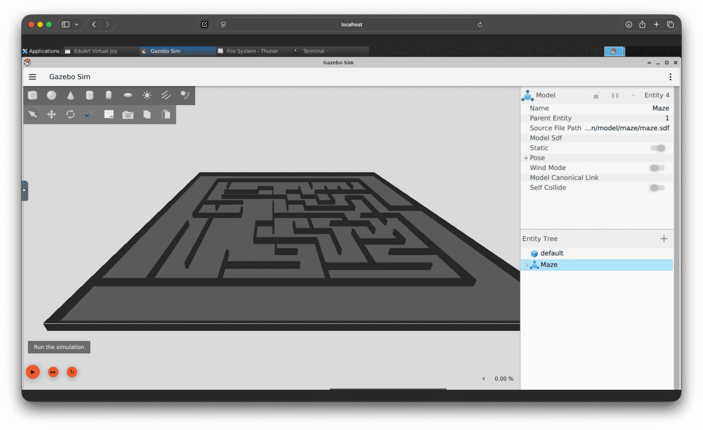
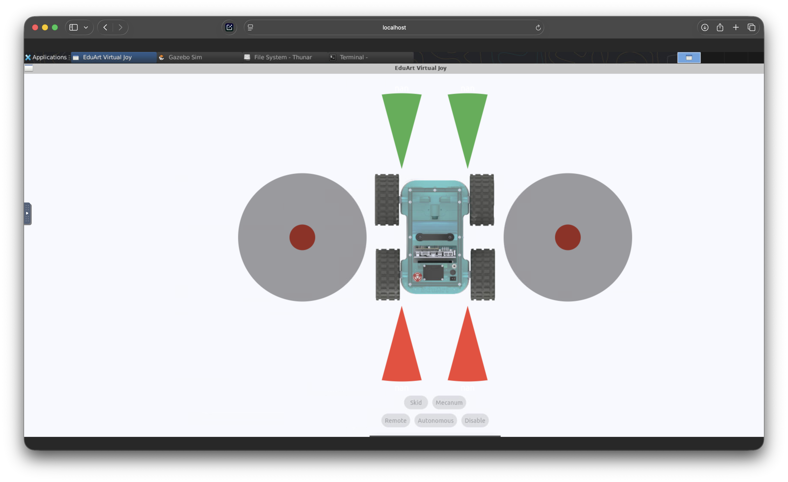
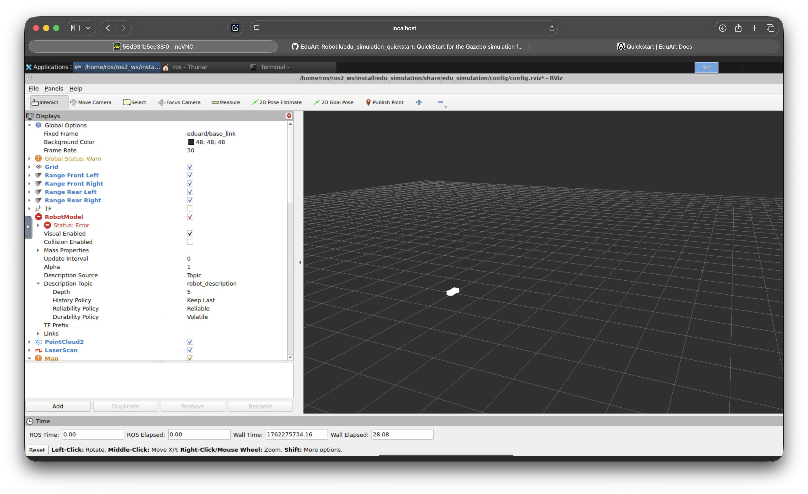

# edu_simulation

## Installation

### Preparation

Als erstes müssen die ganzen Repositories in den ROS2_ws geladen werden. 

```bash
cd /home/ros/ros2_ws/src
```
Wir navigieren wieder in unseren Workspace (erfahrene haben vlt einen anderen Workspace oder einen anderen Benutzernamen als "ros", bitte entsprechend anpassen) und dann in den src Ordner. 

```bash
git clone https://github.com/EduArt-Robotik/edu_robot.git && 
git clone https://github.com/EduArt-Robotik/edu_robot_control.git && 
git clone https://github.com/EduArt-Robotik/edu_simulation.git && 
git clone https://github.com/EduArt-Robotik/edu_virtual_joy.git
```
Alle nötigen Repositories klonen und bauen mit folgendem Befehl:

```
colcon build --symlink-install --packages-select edu_robot edu_robot_control edu_simulation --event-handlers console_direct+
```

Da laufen dann ein paar Minuten lang ganz viele Befehle durch die Kommandozeile.


>>TODO WEITER HIER,   `1 package had stderr output: edu_robot`


Dann öffnen wir 4 Terminalfenster und geben erstmal in alle das hier ein:
```
source /home/ros/ros2_ws/install/setup.bash
```
- wir müssen unseren workspace jedes Mal sourcen. Einer der Hauptfehler, wenn irgendwelche Pakete nicht gefunden werden oder irgendwas nicht geht. Clevere Menschen schreiben das direkt ins Startsktipt vom Dockercontainer … 

Terminal 1: 
```bash
ros2 launch edu_simulation gazebo.launch.py world:=maze.world 
```
- Startet die Gazebo Simulation




Terminal 2:

```bash
ros2 launch edu_simulation eduard.launch.py wheel_type:=mecanum pos_x:=0.0 pos_y:=0.0 pos_z:=0.04 yaw:=0.0 edu_robot_namespace:=eduard/blue
```
- Platziert einen blauen Eduard Roboter im Labyrinth


Terminal 3: 

```bash
ros2 run edu_virtual_joy virtual_joy --ros-args -r __ns:=/eduard/blue
```
- Startet den Joystick 

>>TODO Paket nicht gefunden, wg Fehler oben?



Terminal 4:
```bash
ros2 launch edu_simulation eduard_monitor.launch.py edu_robot_namespace:=eduard/blue
```
- Startet das Monitoring 




--- 


To be able to compile the cloned repositories following packages must be installed. First the Gazebo Harmonic 

```bash
sudo apt-get install curl
sudo curl https://packages.osrfoundation.org/gazebo.gpg --output /usr/share/keyrings/pkgs-osrf-archive-keyring.gpg
echo "deb [arch=$(dpkg --print-architecture) signed-by=/usr/share/keyrings/pkgs-osrf-archive-keyring.gpg] http://packages.osrfoundation.org/gazebo/ubuntu-stable $(lsb_release -cs) main" | sudo tee /etc/apt/sources.list.d/gazebo-stable.list > /dev/null
sudo apt-get update
sudo apt-get install gz-harmonic
```

and

```bash
sudo apt install -y \
  ros-jazzy-hardware-interface \
  ros-jazzy-laser-geometry \
  ros-jazzy-gz-sim-vendor \
  ros-jazzy-ros-gz-bridge \
  ros-jazzy-ros-gz-sim \
  ros-jazzy-xacro \
  ros-jazzy-rviz2 \
  ros-jazzy-diagnostic-updater
```


### Compiling

```bash
cd ~/<your ros2 workspace>
colcon build --symlink-install --packages-select edu_robot edu_robot_control edu_simulation --event-handlers console_direct+
```

## Models


## Launching Simulator

After the package was built Gazebo it will be launched using a provided ROS launch file. This launch file adds all content coming with this package.

Source your ROS2 environment if not already done;

```bash
source ~/<your ros2 workspace>/install/setup.bash
```

Now you can launch Gazebo with the warehouse world using following launch file:

```bash
ros2 launch edu_simulation gazebo.launch.py
```

Alternatively, you can launch Gazebo with the EduArt maze world:
```bash
ros2 launch edu_simulation gazebo.launch.py world:=maze.world 
```

> If you are using a Virtual Machine (Virtual Box, VMWare,...)  and experience the error that the simulation viewport stays gray or black, see this note!

After the Gazebo is launched a Eduard robot can be placed by using following launch file:

```bash
ros2 launch edu_simulation eduard.launch.py wheel_type:=mecanum pos_x:=0.0 pos_y:=0.0 pos_z:=0.04 yaw:=0.0 edu_robot_namespace:=eduard/blue
```
Alternative wheel type is **offroad**. Note: the kinematic is automatically selected by the argument wheel_type and can't be changed by user later.

Press the Play button on the bottom left of the simulation window.
All sensor measurements and other stats can be observed using RViz:

```bash
ros2 launch edu_simulation eduard_monitor.launch.py edu_robot_namespace:=eduard/blue
```
If your robot model stays gray and you do not see any measurement values you might need to adjust the fixed frame to `eduard/blue/base_link`.

>**Note**: The simulator could need some time for launching.

| Launch Argument | Description | Default Value |
|-----------------|-------------|---------------|
| wheel_type | can be **mecanum** or **offroad** | **mecanum** |
| pos_x | spawn position x | 0.0 |
| pos_y | spawn position y | 0.0 |
| pos_z | spawn position z | 0.07 |
| yaw | spawn orientation | 0.0 |
| edu_robot_namespace | robot's namespace | **eduard** |


## After the launch

After launching the simulator and placing a robot into the envrionment (just drag and drop the desired model from the menu on the left), you may notice that not much is happening in there. But before we can move around we first have to enable the motors:

```bash
ros2 service call /eduard/blue/set_mode edu_robot/srv/SetMode
" mode:
  mode: 2
  drive_kinematic: 0
  feature_mode: 0
  disable_feature: 0" 
```

By default the mode is 0, which tells us the motors are disabled. We set the mode to 2, to enable the motors.  
Now the time has come to send a little movement command to our robot. For this we use the following command:

```bash
ros2 topic pub /eduard/blue/cmd_vel geometry_msgs/msg/Twist
"linear:
  x: 0.1
  y: 0.0
  z: 0.0
angular:
  x: 0.0
  y: 0.0
  z: 0.0" -r 10 -p 100
```

We set the linear x velocity to 0.1 and further add -r 10 and -p 100 at the end. The option -r 10 repeats the command 10 times per second and -p 100 just shows us 1 out of every 100 commands sent this way. The reason this is necessary lies in a safety mechanism integrated in the eduard robot, if it receives no movement command for 200ms (even if it tells it to not move at all) it will cease all movement.

## Gazebo in Virtual Machines
When using Gazebo in a Virtual Machine you probably need to set the environment variable `LIBGL_DRI3_DISABLE` to `true`. Either do this when calling the launch-file or inside the launch-description of the launch file. 

### Modify Launch File 
In the `gazebo.launch.py` file:
```python
  return LaunchDescription([
    world_arg,
    SetEnvironmentVariable(name='GZ_SIM_RESOURCE_PATH', value=model_path),
    SetEnvironmentVariable(name='GZ_SIM_SYSTEM_PLUGIN_PATH', value=plugin_path),
    SetEnvironmentVariable(name='LIBGL_DRI3_DISABLE', value='true'),  # Add this line
    gz_sim,
    bridge
  ])
```
### Pass Variable on Launch: 
```bash
LIBGL_DRI3_DISABLE=true ros2 launch edu_simulation gazebo.launch.py
```

## Models

## World

## Usage

### Robots


# Troubleshooting


