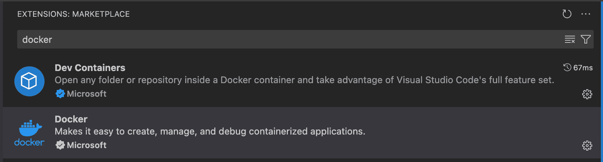

# VSC auf Hostcomputer mit Dockercontainer verbinden

- VSC öffnen
- Code → Preferences → Extensions
- Extension bzw. Plugin "Remote Development" installieren


- Docker Extension auch installieren

- Links unten den grünen Button drücken "Attach to running Container"
![[Bildschirmfoto 2025-11-10 um 16.30.35.png]]
- "Open Folder" →  ros2_ws


# Troubleshooting 
"Unable to write file 'vscode-remote://attached-container … Error: EACCES: permission denied, open '/home/user/ros2_ws/src/test.py')
- Terminal in VSC öffnen und rechte anpassen

```
sudo chown -R user:user /home/user/ros2_ws
```
