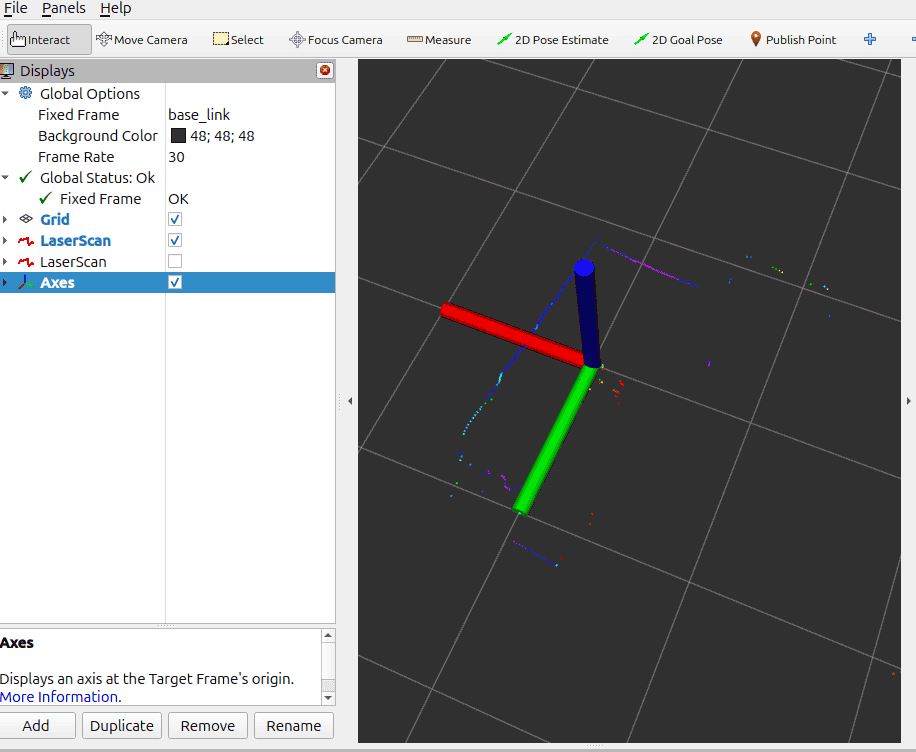
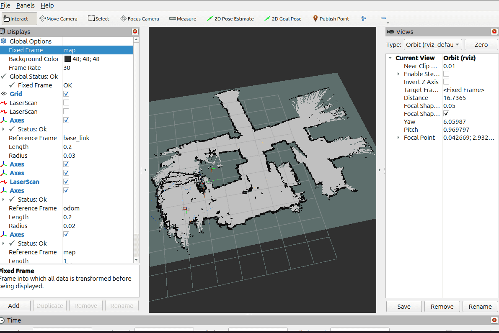
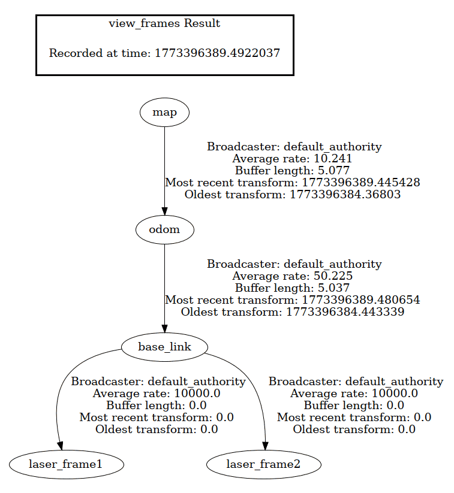

# edu_drive_ros2 Setup

This is the official Repository of edu_drive_ros2. You can follow the instructions on how to set up your Raspberry Pi 5 operating system and the steps to install ROS2 jazzy and the edu_drive package:  
https://github.com/EduArt-Robotik/edu_drive_ros2

# Minibot package Setup

You can clone our ROS2 package that includes all the necessary launch files and configurations for the robot from our Github repository to your ros2 workspace:

https://github.com/autonohm/ohm_rmrc_sml/tree/main/software/minibot_config

You will have to setup the following Installation steps before you can use all the Launchfiles from this package.

# YDLIDAR t-mini plus setup

## Install YDLIDAR-SDK

Install the [ydlidar SDK](https://github.com/YDLIDAR/YDLidar-SDK) from GitHub with the following commands:

```
git clone https://github.com/YDLIDAR/YDLidar-SDK.git
cd YDLidar-SDK
mkdir build
cd build
cmake ..
make
sudo make install
```

In Case you want the Lidars to work in a Virtual Machine, you will have to get USB Passthrough working. For VirtualBox you will have to install the Extension Pack so that you can enable add the Lidar as an USB device in the VM-Settings.

## Install ydlidar_ros2_driver

Clone the [ydlidar repository](https://github.com/YDLIDAR/ydlidar_ros2_driver) into your ros2 workspace:

`git clone -b humble https://github.com/YDLIDAR/ydlidar_ros2_driver.git src/ydlidar_ros2_driver`

Change in `ros2_ws/src/ydlidar_ros2_driver/src/ydlidar_ros2_driver_node.cpp` the line

```c
auto laser_pub = node->create_publisher("scan", rclcpp::SensorDataQoS());
```

to

```c
auto laser_pub = node->create_publisher<sensor_msgs::msg::LaserScan>(
  "scan", rclcpp::SensorDataQoS().reliable());
```

then build the package with `colcon build --symlink-install` and source it with `source ./install/setup.bash`

now you can test ydlidar by launching it  
`ros2 launch minibot_config tmini_launch.py`  
Though, if you haven't done the steps for adding the second lidar, you'll have to change the port to /dev/ttyUSB0 for testing in the parameter file in `minibot_config/params/Tmini1.yaml`

you can listen to the scan topic to verify your lidar node is working:  
`ros2 topic echo /lidar1/scan`

## Adding the second lidar

Because of some quirks of how the ydlidar SDK works, it's not enough to just use the ports /dev/ttyUSB0 and /dev/ttyUSB1 for the lidars in order to use them. In our testing using these ports together caused corrupted lidar data. Instead, we need to map our lidars to the physical USB ports of the Raspberry Pi

Find out which COM Ports are used for the Lidars (it's usually USB0 and USB1 if nothing else is connected):

```bash
ls -l /dev/ttyUSB*
```

We'll need to find the physical addresses of the USB ports to prevent them from changing from having a bad connection. This is how we find out which physical port path each lidars use (if you had different USB Ports listed above, use those in these commands):

```bash
udevadm info -a -n /dev/ttyUSB0 | grep -m1 -E 'KERNELS=="[0-9]-[0-9](\.[0-9])?"'
udevadm info -a -n /dev/ttyUSB1 | grep -m1 -E 'KERNELS=="[0-9]-[0-9](\.[0-9])?"'
```

Make udev rules to identify the lidars by their ids. First create the following file:  
`cd ~ sudo nano /etc/udev/rules.d/99-ydlidar.rules`

Then add these rules in the file and change the KERNELS attribute with your value from the previous step:

```bash
SUBSYSTEM=="tty", ATTRS{idVendor}=="10c4", ATTRS{idProduct}=="ea60", KERNELS=="2-2", SYMLINK+="ydlidar_front", MODE="0660", GROUP="dialout"

SUBSYSTEM=="tty", ATTRS{idVendor}=="10c4", ATTRS{idProduct}=="ea60", KERNELS=="4-2", SYMLINK+="ydlidar_rear", MODE="0660", GROUP="dialout"
```

if you're having problems with one of your lidars or are using a different model you can check the attributes yourself with these commands:

```bash
udevadm info -a -n /dev/ttyUSB0 | head -n 120
udevadm info -a -n /dev/ttyUSB1 | head -n 120
```

After creating the rules, reload them and check if the mapping has worked:

```bash
sudo udevadm control --reload-rules
sudo udevadm trigger
ls -l /dev/ydlidar_*
```

You should now see both of your lidars. you can then use `/dev/ydlidar_front` and `/dev/ydlidar_rear` for as ports for the lidar parameter files in minibot_config in `params/Tmini1.yaml` and `params/Tmini2.yaml`

## Correct TF for the Lidars

We've set up our Lidars to scan their surroundings. Now we'll make sure they are positioned correctly. If you're using the same setup and have positioned the Lidars like we have (The Lidar Port pointing to the side inwards to the robot) you can skip this step.  
If you've positioned your Lidars differently or are using different Lidars you'll have to change the parameters of the tf2 Nodes in the Launch file.

These are the default tf2 Arguments for Lidar1:

```python
arguments=['0', '0', '0.02','0', '1', '0', '0','base_link','laser_frame1']
```

And this is what they mean:  
`arguments=['x_pos', 'y_pos', 'z_pos','qx', 'qy', 'qz', 'qw','base_link','laser_frame']`

The arguments tell the robot how the Lidar data needs to be transformed, to be in the right place relative to the robots coordinate system **base_frame**. qx, qy, qz and qw are Quaternion Rotation parameters. There are Quaternion to Euler Rotation Tools Online if you're not familiar with them.

Launch the lidar node on the robot

```bash
ros2 launch minibot_config tmini_launch.py
```

You can open rviz2 by typing `rviz2` into your terminal.  
Choose base_link as your fixed frame and two axis and set them to laser_frame1 and laser_frame2. Also add your Laserscans by Topic.  


For ROS robots it is standard to have the x-Axis (red) point forward and the z-Axis (blue) point up. We need to adjust the tf parameters so the scan matches that. If your scan seems mirrored, your x or y Axis might be flipped. Test the orientation of your lidars by moving your hand in front of the lidars and see where that is displayed in rviz.

After changing the parameters in the launch file, run  
`colcon build --symlink-install`  
and launch the lidar nodes again to verify their new tf pose. You will need to quit rviz2 before running the launch file to prevent errors with the lidars.

## Install minibot_scan_fusion

We need to install the [minibot_scan_fusion package](https://github.com/neo-viktorpetrenko/minibot_scan_fusion) in order to pass the two lidars we have as one lidar to the SLAM toolbox. It transforms all the points from the rear lidar to the front lidar so it's as if the front lidar scanned everything by itself.

If you followed the previous steps you can just clone the package without any changes.

clone it to your ros2 source directory:  
`git clone https://github.com/neo-viktorpetrenko/minibot_scan_fusion`

# SLAM

## SLAM Setup

The [SLAM Toolbox](https://github.com/SteveMacenski/slam_toolbox) is used to use both the lidar and odometry data of a robot generate a map of its surroundings and to position itself within it.

Install the SLAM Toolbox through apt:  
`sudo apt update`  
`sudo apt install ros-$ROS_DISTRO-slam-toolbox`

We can then run edu_drive, the lidar nodes and slam all together with this launchfile:  
`ros2 launch minibot_config minibot.launch.py`

In rviz2 you can now add the app by topic. It should update when you drive the robot around  


If you encounter problems concerning frame transformations, you can check, if the tf frames are set up correctly by running: `ros2 run tf2_tools view_frames`  
this will create a pdf file where the relationship between the frames is shown.  


# Nav2 Setup

The [Nav2 Package](https://github.com/ros-navigation/navigation2) is used to navigate the robot through the map that was generated with the SLAM toolbox

You can install it like this:

```bash
source /opt/ros/jazzy/setup.bash
sudo apt install \
  ros-$ROS_DISTRO-navigation2 \
  ros-$ROS_DISTRO-nav2-bringup \
  ros-$ROS_DISTRO-nav2-minimal-tb*
```

Now, after having started the rest of the software stack:

`ros2 launch minibot_config minibot.launch.py`

You can start the Nav2 Nodes with the launchfile in minibot_config:

`ros2 launch minibot_config navigation_launch.py`