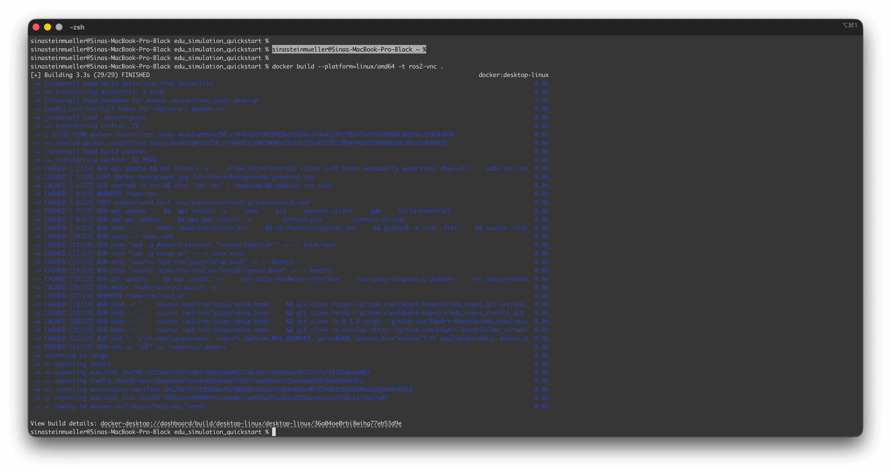
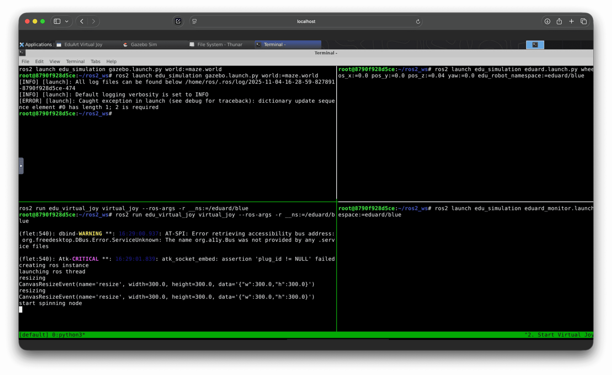
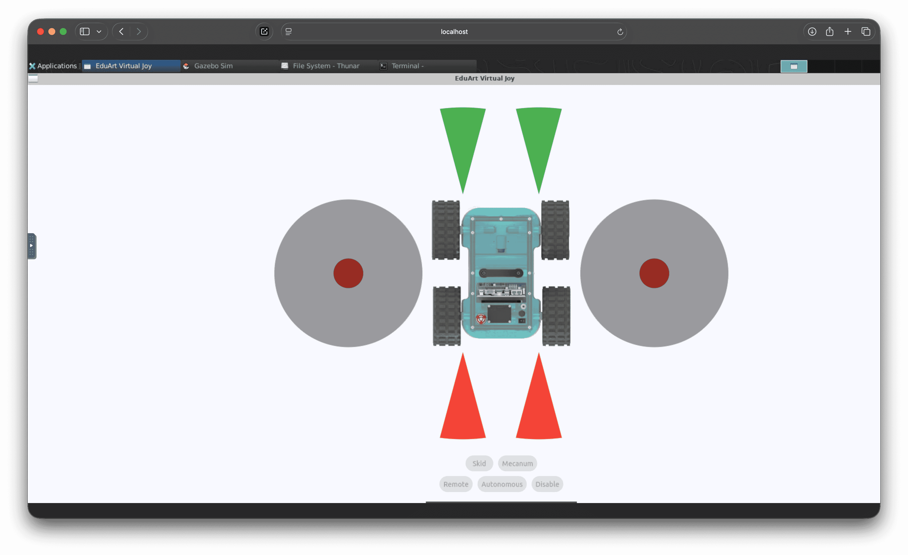

# Quick Start with Docker

This guide is designed to get you started quickly with the Eduard Simulation. If you don't feel like manual setup and want to start gaining first-hand experience with the simulation right away, this guide is for you. If you want to learn how to set up your Linux environment yourself, skip this chapter and begin with "[Platform-Independent Installation with Docker](2_schnellstart-docker.md)".

The following quickstart guides are operating system independent to avoid setting up Ubuntu on your own operating system or as a virtual machine. For Linux users, it's recommended to use the "standard" installation (continue to [Create ROS Workspace](3_Manuelle_Installation/3_ros-workspace.md)).

## Prerequisites

- Existing GitHub account with SSH key configured for `git clone`
- [Git](https://git-scm.com/) installed (usually automatic on Mac, must be downloaded on Windows)
- [Create SSH Key](1_github-ssh-key.md) using the EduArt guide
- [Official GitHub Guide](https://docs.github.com/en/authentication/connecting-to-github-with-ssh/generating-a-new-ssh-key-and-adding-it-to-the-ssh-agent)

## Required Software

- [Docker Hub](https://docs.docker.com/desktop/setup/install/mac-install/) installed, terms accepted, and opened once

Optional:
- [VNC Viewer](https://www.realvnc.com/de/connect/download/viewer/) installed
- [Visual Studio Code](https://code.visualstudio.com/download) installed

## Installation

- Create a folder named "EduArt" in your Documents. Name it exactly "EduArt" or the following commands won't work.
- Open the EduArt folder in your file manager

On Mac:
- Right-click the folder name in the path bar at the bottom and select "Open in Terminal"

On Windows:
- Right-click and select "Open in PowerShell" or "Open in Terminal"

In the terminal:
- Navigate into the folder using `cd`, e.g.
```
cd Documents/EduArt
```
- Press enter

Open terminal and enter the following command:
```
git clone git@github.com:EduArt-Robotik/edu_simulation_quickstart.git
```
- If you see "authentication failed", your GitHub SSH key is not configured correctly

Once the repo is cloned:
```
cd edu_simulation_quickstart
```

Build the Docker container (takes 3-20 minutes depending on your computer and RAM):
```
docker build --platform=linux/amd64 -t ros2-vnc .
```
- Whenever you make changes to the Dockerfile or supervisord.config, you must rebuild. Changes can include the container background image or screen resolution.



Once the container is successfully built, start the Docker container:
```
docker compose -f docker-compose.yml up
```


Then open in your browser: http://localhost:8080/vnc.html and click "Connect"


Optionally integrate with VNC Viewer:
- Open VNC Viewer (or alternative software)
- File / New Connection / localhost:5900

## Tips
- Copy + paste via the noVNC sidebar on the left

## Start Simulation

Open a terminal in the simulation.
Enter the following command to automatically open a 4-split terminal window with 4 commands:

```
start-simulation.sh
```



In window 1 (top left), "Gazebo" starts and displays a maze. There's a "Run the simulation" button in the bottom left—click it.


In window 2 (bottom left), the virtual controller for the robot starts.



Window 3 (top right) places a blue Eduard robot in the maze from window 1. Once you've started the simulation in window 1, click in this terminal window (the green bar at the bottom right shows the window name "3. Add Eduard"). Press Enter, and the blue robot appears in the maze. Resize the window if needed to see the buttons at the bottom, then press "Remote". Success is indicated when the button turns green. Now you can drive with the left joystick and rotate with the right joystick.

Optional: Window 4 opens monitoring in RViz.


## Troubleshooting

Error: `✘ ros2-vnc Error pull access denied for ros2-vnc, repository does not exist or may require 'docker login'` or `if container already exists`:

```
docker compose -f docker-compose.run.yml down
```

Then:
```
docker compose -f docker-compose.run.yml up
```

Error `ERROR: Cannot connect to the Docker daemon at unix:///Users/sinasteinmueller/.docker/run/docker.sock. Is the docker daemon running?`
- Start the Docker Desktop app

Screen resolution doesn't fit (container content too small, too large, or cut off): Edit the `supervisord.config` file and change the line `command=/usr/bin/Xvfb :0 -screen 0 1920x900x24` with your desired resolution, e.g. to 1280x1024x24

## Tips

Change container screen size:
- In the `supervisord.conf` file in the cloned repo, modify this line:

```
command=/usr/bin/Xvfb :0 -screen 0 1920x900x24
```

Change background image:
- Before building the container, replace the current background image `Docker-Background.svg` with your new SVG (!) file
- Rebuild and restart the repo

