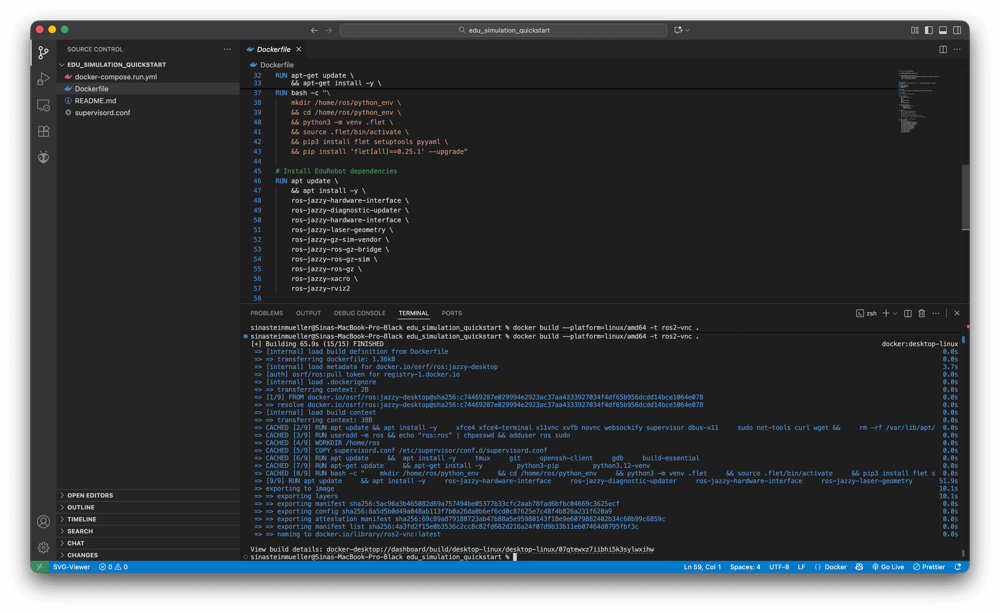
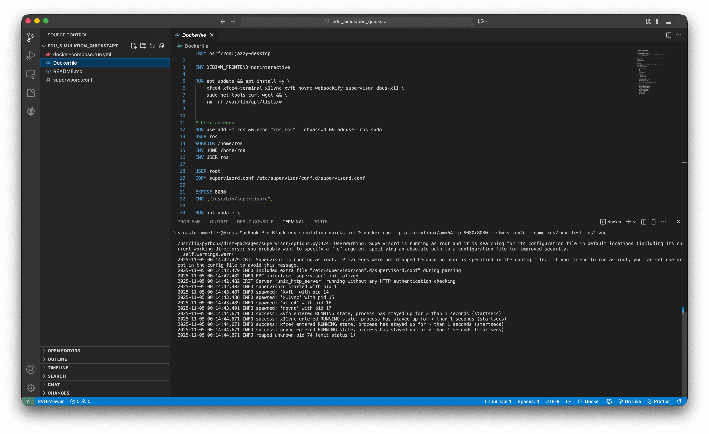
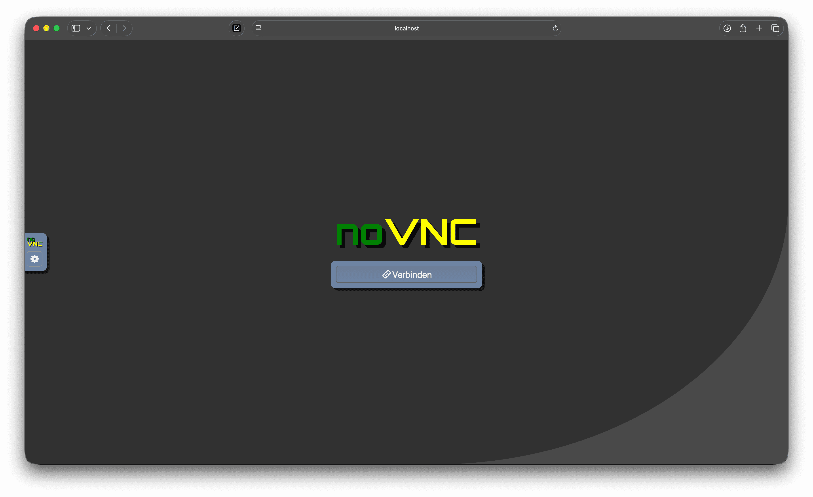
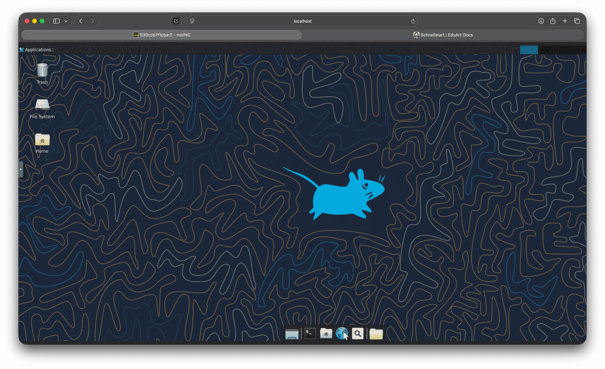

# Platform-Independent Installation with Docker

This guide is aimed at those who do not want to clone a pre-made repository but instead want to create an empty, functional Linux Docker container themselves and display it either in the browser or in the VNC Viewer. This is recommended for Mac and Windows users; Linux or Ubuntu users can proceed directly to the chapter >>TODO ROS Workspace.

## Prerequisites

- An existing GitHub account with an SSH key set up for `git clone` [Guide](https://docs.github.com/en/authentication/connecting-to-github-with-ssh/generating-a-new-ssh-key-and-adding-it-to-the-ssh-agent)

## Required Software

- Docker Hub [Download link](https://docs.docker.com/desktop/setup/install/mac-install/), installed, terms accepted, and opened
- Visual Studio Code installed [Download link](https://code.visualstudio.com/download)

optional
- VNC Viewer installed [Download link](https://www.realvnc.com/de/connect/download/viewer/)

## Installation
- Create a folder named "edu_simulation_quickstart" in your Documents
- Open the folder edu_simulation_quickstart in VSC as a workspace (the folder name doesn't matter much, but we are building a simplified version of the quickstart from the previous chapter, hence we will use this name going forward.)
- Create the following files (Readme.md is optional)


Copy the following content into the files:

### Dockerfile

```dockerfile
FROM osrf/ros:jazzy-desktop

ENV DEBIAN_FRONTEND=noninteractive

# -------------------------------------------------------------------
# Create custom user and configure the user settings
# -------------------------------------------------------------------

# Create User
RUN useradd -m user -s /bin/bash && echo "user:user" | chpasswd && adduser user sudo
USER root


# -------------------------------------------------------------------
# Install dependencies
# -------------------------------------------------------------------


RUN apt update &&  apt install -y \
    tmux git openssh-client gdb build-essential software-properties-common swig

RUN apt-get update && apt-get install -y \
    python3-pip python3.12-venv python3-pip

RUN apt update && apt install -y \
    xfce4 xfce4-terminal x11vnc xvfb novnc websockify supervisor dbus-x11 \
    sudo net-tools curl wget

# Install GPIO MRAA lib for edu_robot_control_template
# Build and install MRAA from source
RUN git clone https://github.com/eclipse/mraa.git /opt/mraa \
    && cd /opt/mraa && mkdir build && cd build \
    && cmake .. -DBUILDSWIGPYTHON=ON \
    && make -j$(nproc) && make install \
    && ldconfig \
    && rm -rf /opt/mraa


# Install edu_robot dependencies
RUN apt update \
    && apt install -y \
    ros-jazzy-rmw-cyclonedds-cpp \
    ros-jazzy-hardware-interface \
    ros-jazzy-diagnostic-updater \
    ros-jazzy-hardware-interface \
    ros-jazzy-laser-geometry \
    ros-jazzy-gz-sim-vendor \
    ros-jazzy-ros-gz-bridge \
    ros-jazzy-ros-gz-sim \
    ros-jazzy-ros-gz \
    ros-jazzy-xacro \
    ros-jazzy-rviz2

# Create virtual environment with python modules for edu_virtual_joy
RUN bash -c "\
    mkdir /home/user/python_env -p \
    && cd /home/user/python_env \
    && python3 -m venv .flet \
    && source .flet/bin/activate \
    && pip3 install flet setuptools pyyaml \
    && pip install 'flet[all]==0.25.1' --upgrade"
# -------------------------------------------------------------------
# Install packages for simulation
# -------------------------------------------------------------------

# Create Ros2 workspace
# … 

# Get edu_robot package
# …

# Set Python environment
ENV PYTHONPATH='/home/ros/python_env/.flet/lib/python3.12/site-packages'

# Enable color on command prompt
ENV TERM=xterm-256color
ENV color_prompt=yes


# VNC setup
RUN mkdir -p /home/user/supervisor/logs /home/user/supervisor/run && \
    chown -R user:user /home/user/supervisor
COPY --chown=user:user supervisord.conf /home/user/supervisor/supervisord.conf

# -------------------------------------------------------------------
# Configure the user space
# -------------------------------------------------------------------

USER user
WORKDIR /home/user
ENV HOME=/home/user
ENV USER=user


# -------------------------------------------------------------------
# Environment variables
# -------------------------------------------------------------------

# Set Python environment
ENV PYTHONPATH='/home/user/python_env/.flet/lib/python3.12/site-packages'

# Enable color on command prompt
ENV TERM=xterm-256color
ENV color_prompt=yes

# Start supervisord
CMD ["/usr/bin/supervisord"]
```

The Docker container used as the base can be found in the Docker app on Docker Hub. As an alternative, other ROS and Linux versions can also be used.

All other commands, for example, create the user "ros," download packages, install things, or create folders that may be needed later. You could also skip all of this in the file and install the missing packages individually in the new operating system's terminal. However, we save ourselves the effort and hassle of installing all the missing packages one by one.

## supervisord.conf

```config
[supervisord]
nodaemon=true

[program:Xvfb]
command=/usr/bin/Xvfb :0 -screen 0 1920x900x24
priority=1
autostart=true
autorestart=true

[program:x11vnc]
command=/usr/bin/x11vnc -display :0 -forever -nopw -shared
priority=2
autostart=true
autorestart=true

[program:xfce4]
command=/usr/bin/startxfce4
environment=DISPLAY=":0"
priority=3
autostart=true
autorestart=true

[program:novnc]
command=/usr/share/novnc/utils/novnc_proxy --vnc localhost:5900 --listen 8080
priority=4
autostart=true
autorestart=true
```

This file ensures that a computer without a real screen still has a graphical interface.  
**Xvfb** pretends that there is a screen.  
**x11vnc** makes this screen accessible over the internet.  
**xfce4** displays the desktop, and **noVNC** allows you to view it directly in a web browser.

## Testing the Container

Now that we can display a Linux operating system in our browser, that's enough for now. We will open a terminal in VSC and enter the following command to build the container.

```
docker build --platform=linux/amd64 -t ros2-vnc .
```

It should look something like this (it may take a few minutes):

Now we start the container:

```
docker run --platform=linux/amd64 -p 8080:8080 --shm-size=2g --name ros2-vnc-test ros2-vnc
```

It should look something like this:


Then we open the browser and enter: http://localhost:8080/vnc.html 



Click "Connect" and we have a Linux operating system in the browser.



You can stop everything in the terminal with ctrl + c (but then the website will also be unreachable).

If you want to view it in the VNC Viewer instead of the browser, you can download it (or similar programs). Copy and paste is, for example, a bit easier than in the browser version. 

Then in the VNC Viewer 
`File / New Connection / localhost:5900` 


The only thing to keep in mind is that the terminal command now needs to be supplemented with a second port. We start with

```
docker run -it \
  -p 8080:8080 \
  -p 5900:5900 \
  --shm-size=2g \
  --name ros2-vnc-test \
  ros2-vnc
```

You can use the up arrow key to scroll through previous Linux command line commands. And since it's tedious to click through such long commands every time, we will create the last file now.

### docker-compose.run.yml


```yml
services:
  ros2-simulation:
    build:
      context: .
      dockerfile: ./Dockerfile
    container_name: ros2-vnc-test
    user: user
    environment:
      - ROS_DOMAIN_ID=0
      - RMW_IMPLEMENTATION=rmw_fastrtps_cpp
    ports:
      - "8080:8080"
      - "5900:5900"
    #  - "7400-7743:7400-7743"
    #network_mode: host
    shm_size: "2g"
    tty: true
    stdin_open: true
    restart: unless-stopped
    command: bash -c '/usr/bin/supervisord -c /home/user/supervisor/supervisord.conf'
```
This does nothing other than shorten the last command from above to 

```
docker compose -f docker-compose.run.yml up
```

To make this work, we need to delete the container built the old way once:

```
docker rm -f ros2-vnc-test
```

Now we can start the Docker container.

```
docker compose -f docker-compose.run.yml up
```

Or stop it.

```
docker compose -f docker-compose.run.yml down
```

Now let's continue with creating a ROS workspace in our Linux operating system.

## Troubleshooting

`ERROR: Cannot connect to the Docker daemon at unix:///Users/sinasteinmueller/.docker/run/docker.sock. Is the docker daemon running?`
- start Docker Hub App 

`docker: Error response from daemon: Conflict. The container name "/ros2-vnc-test" is already in use by container`
- put in the following command to close the container 

```
docker rm -f ros2-vnc-test
```