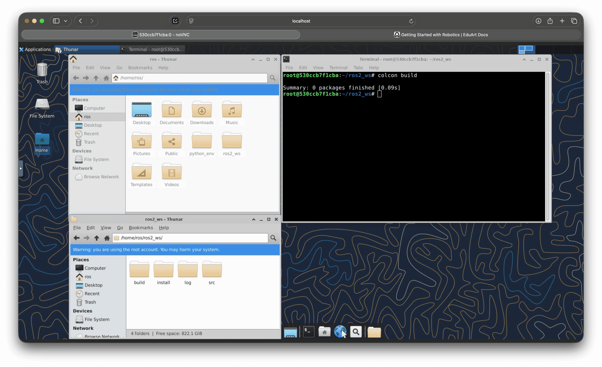

# Creating a ROS2 Workspace

- Create a folder "ros2_ws" in the home directory of the Linux operating system.
- Inside "ros2_ws", create the folder src.
- Then navigate back to the folder ros2_ws and open a terminal window here.
- Enter the following command:

```
colcon build
```
- This will create the folders Build, Install, and Log.



Alternatively, instead of the manual creation mentioned above, you can also solve this via the terminal by simply entering the following command:

```
mkdir -p /home/user/ros2_ws/src && cd /home/user/ros2_ws && colcon build
```

Next, start the simulation tutorial.
