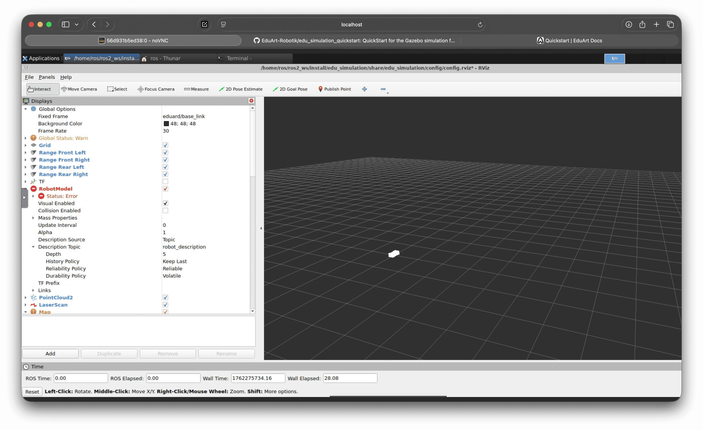

# Simulation Start

## Installation

### Preparation

First, all the repositories need to be loaded into the ROS2 workspace.

```bash
cd /home/user/ros2_ws/src
```
We navigate back to our workspace (experienced users may have a different workspace or username than "ros", please adjust accordingly) and then into the src folder.

```bash
git clone https://github.com/EduArt-Robotik/edu_robot.git && 
git clone https://github.com/EduArt-Robotik/edu_robot_control.git && 
git clone https://github.com/EduArt-Robotik/edu_simulation.git && 
git clone https://github.com/EduArt-Robotik/edu_virtual_joy.git
```
Clone and build all necessary repositories with the following command:

```
colcon build --symlink-install --packages-select edu_robot edu_robot_control edu_simulation --event-handlers console_direct+
```

This will run several commands in the command line for a few minutes.

Then, we open 4 terminal windows and enter the following command in all of them:
```
source /home/user/ros2_ws/install/setup.bash
```
- We need to source our workspace every time. This is one of the main errors when packages are not found or something doesn't work. Clever people write this directly into the startup script of the Docker container…

Terminal 1: 
```bash
ros2 launch edu_simulation gazebo.launch.py world:=maze.world 
```
- Starts the Gazebo simulation


Terminal 2:

```bash
ros2 launch edu_simulation eduard.launch.py wheel_type:=mecanum pos_x:=0.0 pos_y:=0.0 pos_z:=0.04 yaw:=0.0 edu_robot_namespace:=eduard/blue
```
- Places a blue Eduard robot in the maze


Terminal 3: 

```bash
ros2 run edu_virtual_joy virtual_joy --ros-args -r __ns:=/eduard/blue
```
- Starts the joystick 


Terminal 4:
```bash
ros2 launch edu_simulation eduard_monitor.launch.py edu_robot_namespace:=eduard/blue
```
- Starts the monitoring 


