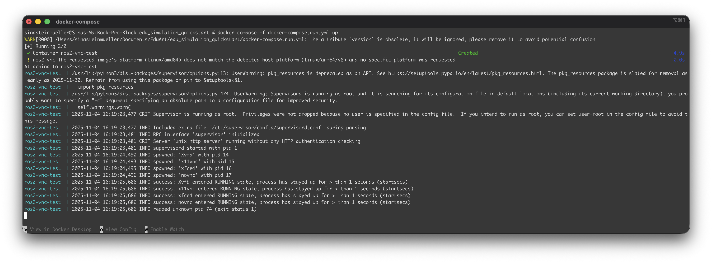
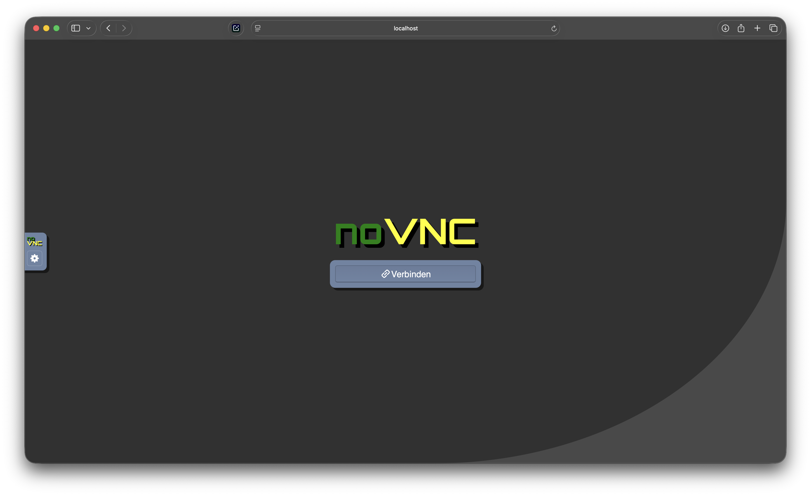

# Quickstart

This guide is intended to get you started quickly with the Eduard Simulation. If you don't want to do the manual setup and want to start experiencing the simulation right away, this guide is for you. If you want to learn how to set up your Linux environment yourself, skip this chapter and start with "Manual Setup".

The following quickstart instructions are OS-independent to avoid setting up Ubuntu on your host OS or as a virtual machine. Linux users are recommended to use the "normal" installation (continued at tbd).

## Prerequisites

- Existing GitHub account with an SSH key configured for `git clone` [Instructions](https://docs.github.com/en/authentication/connecting-to-github-with-ssh/generating-a-new-ssh-key-and-adding-it-to-the-ssh-agent)

## Required software

- Docker Desktop [Download link](https://docs.docker.com/desktop/setup/install/mac-install/), installed, terms accepted and launched

Optional
- VNC Viewer installed [Download link](https://www.realvnc.com/de/connect/download/viewer/)
- Visual Studio Code installed [Download link](https://code.visualstudio.com/download)

## Installation
- Create a folder named "EduArt" in your Documents
- Open the EduArt folder in the file manager

On Mac:
- Right-click the folder name in the path bar at the bottom and choose "Open in Terminal"

On Windows:
- Right-click "Open in PowerShell" or "Open in Terminal"

In the terminal:
- Use `cd` to navigate into the folder, e.g.
```
cd Documents/EduArt
```
- press Enter

Open a terminal and run the following command:
```
git clone git@github.com:EduArt-Robotik/edu_simulation_quickstart.git
```
- if you see "authentication failed" here, the GitHub SSH key is not set up correctly

When the repo has finished cloning:
```
cd edu_simulation_quickstart
```

Build the Docker container (takes about 3–20 minutes depending on computer and RAM).
```
docker build --platform=linux/amd64 -t ros2-vnc .
```


When the container has been built successfully, start the Docker container:
```
docker compose -f docker-compose.run.yml up
```




Then open in your browser: http://localhost:8080/vnc.html and click "Connect"



Optional: add to VNC Viewer
- Open VNC Viewer (or alternative software)
- File / New Connection / localhost:5900 

## Tips
- Copy + paste via the noVNC sidebar on the left

## Start the simulation
Open the terminal in the simulation; a four-pane terminal with 4 commands will open automatically.


In pane 1 (top left) the program Gazebo starts and shows a maze. In the bottom left there is a button "Run the simulation" — press it.


In pane 2 (bottom left) the virtual controller for the robot starts.


Pane 3 (top right) places a blue Eduard robot into the maze in pane 1. If you started the simulation in pane 1, click this terminal pane (the pane name "3. Add Eduard" will appear in the green bar at the bottom right). Press Enter and the blue robot will appear in the maze.
Resize the window if needed so you can see the buttons at the bottom and press "Remote". It is successful if the button turns green. Then you can drive with the left joystick and rotate with the right joystick.


Optional: pane 4 opens the monitoring in RViz.


## Troubleshooting

Error: ` ✘ ros2-vnc Error pull access denied for ros2-vnc, repository does not exist or may require 'docker login'` or:  `if container already exists`: 

```
docker compose -f docker-compose.run.yml down
```

and then
```
docker compose -f docker-compose.run.yml up
```
